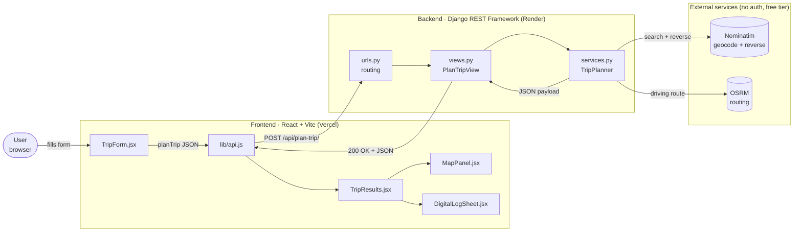
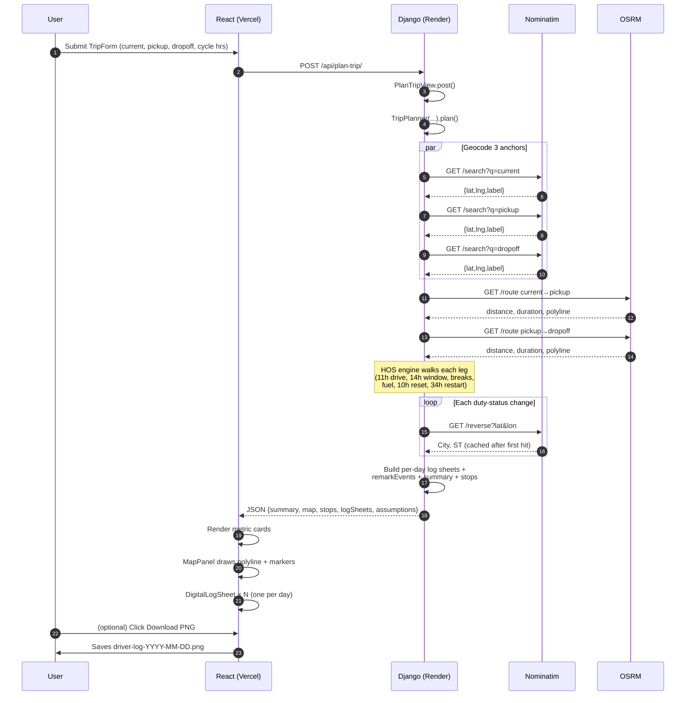

# Architecture

## System overview



## Request lifecycle



## Response payload shape

```text
{
  summary: {
    totalMiles, totalDrivingHours, totalTripHours,
    route: [{label, value}, ...]
  },
  map: {
    center: {lat, lng},
    routePolyline: [{lat, lng}, ...],
    markers: [{title, location, ...}, ...]
  },
  stops:    [{title, location, timestamp, ...}],
  logSheets: [
    {
      date, displayDate,
      segments:    [{status, label, startHour, endHour, hours, miles}],
      remarkEvents:[{hour, location, label}],
      totals:      {offDuty, sleeper, driving, onDuty},
      header:      {month, day, year, fromLocation, toLocation, ...},
      remarks:     [string]
    }
  ],
  assumptions: [string]
}
```

## What lives where

| Layer | File | Responsibility |
|---|---|---|
| Frontend entry | `frontend/src/main.jsx` | Mounts React |
| App shell | `frontend/src/App.jsx` | Form → loading → results state |
| API client | `frontend/src/lib/api.js` | Single `planTrip()` fetch wrapper, base URL via `VITE_API_BASE_URL` |
| Form | `frontend/src/components/TripForm.jsx` | Inputs + submit |
| Output | `frontend/src/components/TripResults.jsx` | Metric cards, dispatch summary, log sheets grid |
| Map | `frontend/src/components/MapPanel.jsx` | Leaflet polyline + stop markers |
| Log render | `frontend/src/components/DigitalLogSheet.jsx` | Native SVG FMCSA log + PNG export |
| URL routing | `backend/route_planner/urls.py` + `backend/planner/urls.py` | `POST /api/plan-trip/` |
| HTTP layer | `backend/planner/views.py` | DRF `APIView` adapter |
| Domain logic | `backend/planner/services.py` | Geocoding, routing, HOS engine, log-sheet builder |
| Tests | `backend/planner/tests.py` | Backend unit tests |

## Why stateless

- No database. Every plan is recomputed from inputs.
- Trade-off: simpler deploy, no migrations, no auth — at the cost of no history and no shareable trip URLs. Both would be a small Django model away if needed.
